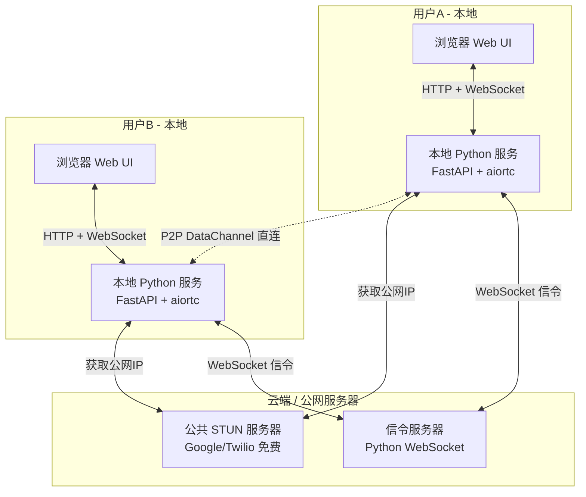

# P2P Chat 系统架构设计

## 技术方案：信令服务器 + STUN（无 TURN）

## 系统架构图



## 通信流程

```mermaid
sequenceDiagram
    participant A as 用户A 浏览器
    participant AL as 用户A 本地服务
    participant S as 信令服务器
    participant BL as 用户B 本地服务
    participant B as 用户B 浏览器

    Note over A,B: 1. 注册阶段
    AL->>S: WebSocket 连接 + 注册用户名
    BL->>S: WebSocket 连接 + 注册用户名
    S-->>AL: 在线用户列表
    S-->>BL: 在线用户列表

    Note over A,B: 2. P2P 连接建立
    A->>AL: 请求连接用户B
    AL->>AL: 创建 RTCPeerConnection + Offer SDP
    AL->>S: 转发 Offer 给用户B
    S->>BL: 转发 Offer
    BL->>BL: 创建 Answer SDP
    BL->>S: 转发 Answer 给用户A
    S->>AL: 转发 Answer
    AL->>AL: ICE 候选交换 via 信令
    BL->>BL: ICE 候选交换 via 信令

    Note over A,B: 3. P2P 直连建立成功
    AL<-->BL: DataChannel 直连

    Note over A,B: 4. 聊天阶段 - 消息不经过服务器
    A->>AL: 发送消息
    AL->>BL: P2P DataChannel
    BL->>B: 显示消息
```

## 技术选型

| 组件 | 技术 | 说明 |
|------|------|------|
| 信令服务器 | Python + websockets | 轻量级，仅负责转发 SDP 和 ICE 候选 |
| 本地后端 | FastAPI + uvicorn | 提供 Web 页面和 WebSocket 接口 |
| P2P 连接 | aiortc | Python 的 WebRTC 实现 |
| STUN 服务器 | stun.l.google.com:19302 | Google 免费公共 STUN |
| Web 前端 | HTML + CSS + JavaScript | 原生实现，无需框架 |
| 前后端通信 | WebSocket | 本地浏览器与本地 Python 服务之间 |

## 项目结构

```
d:/p2pchat/
├── signal_server/          # 信令服务器（部署在公网）
│   ├── server.py           # WebSocket 信令服务
│   └── requirements.txt
├── client/                 # 本地客户端
│   ├── app.py              # FastAPI 本地 Web 服务
│   ├── p2p.py              # P2P 连接管理（aiortc）
│   ├── requirements.txt
│   ├── static/             # 前端静态文件
│   │   ├── index.html      # 聊天页面
│   │   ├── style.css       # 样式
│   │   └── app.js          # 前端逻辑
│   └── templates/          # 如需模板
└── README.md               # 使用说明
```

## 核心依赖

### 信令服务器
- `websockets` - WebSocket 服务端

### 本地客户端
- `fastapi` - Web 框架
- `uvicorn` - ASGI 服务器
- `websockets` - 连接信令服务器
- `aiortc` - Python WebRTC 实现
- `aiohttp` - 异步 HTTP（aiortc 依赖）

## 功能清单

### 基础功能
- 用户注册（输入昵称）
- 在线用户列表（实时更新）
- 一对一文字聊天
- P2P 直连状态显示

### 补充功能（自行补充）
- 消息时间戳显示
- 连接状态指示器（连接中/已连接/断开）
- 聊天记录本地保存（localStorage）
- 发送文件功能（利用 DataChannel）
- 系统通知（用户上线/下线提醒）
- 消息已读回执
- 支持 Emoji 表情

## 部署说明

1. 信令服务器需要部署在公网可访问的地方（或两台电脑都能访问的服务器）
2. 本地客户端在每台电脑上运行，启动后打开浏览器访问 localhost
3. 开发测试阶段，信令服务器可以跑在本地局域网
