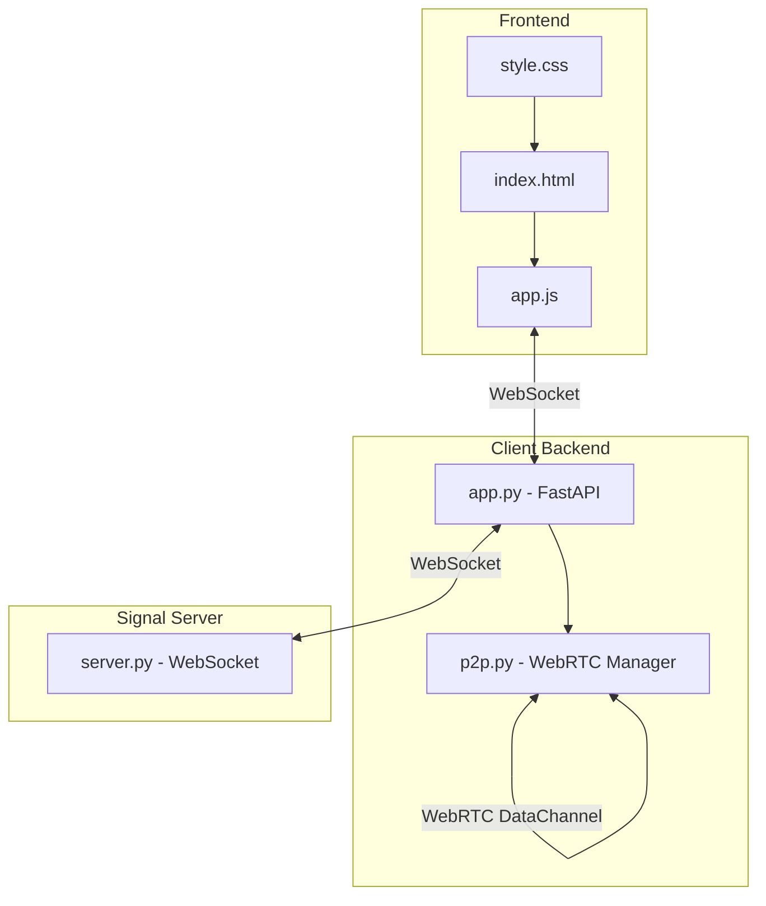
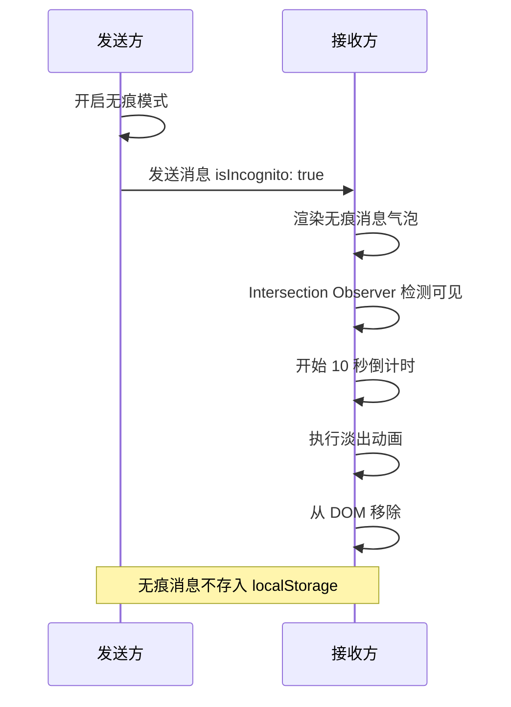
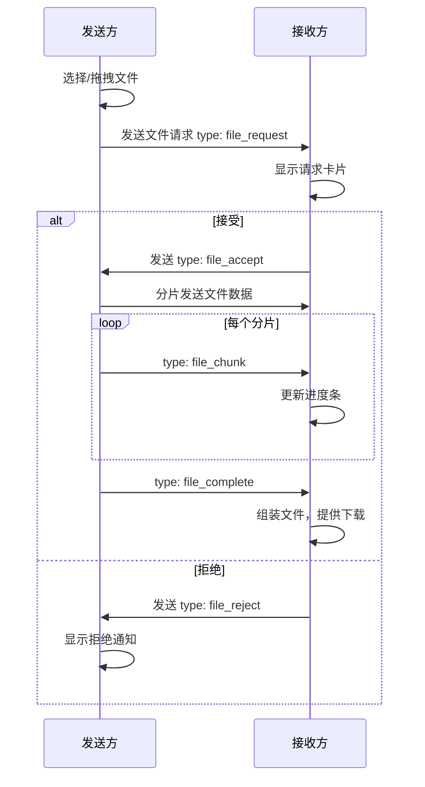
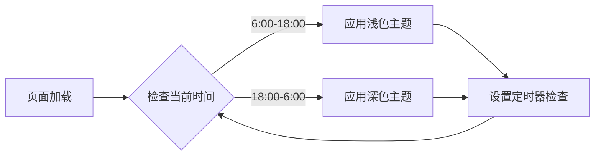
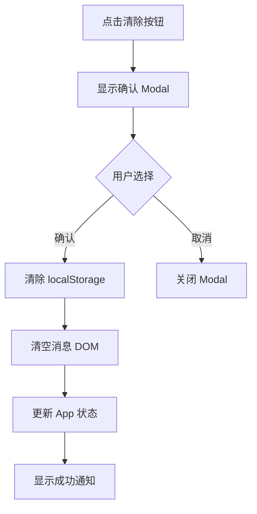

# P2P Chat 四大功能集成计划

## 项目概述

在现有 P2P 聊天应用基础上集成四个核心功能：
1. 无痕消息模式 (Incognito Mode)
2. P2P 文件传输工作区 (File Transfer Workspace)
3. 动态氛围主题 (Dynamic Ambiance Theme)
4. 清空本地聊天数据 (Clear Local Data)

## 现有架构分析



### 关键文件
- `client/static/index.html` - 前端 HTML 结构
- `client/static/style.css` - CSS 样式，使用 CSS 变量
- `client/static/app.js` - 前端逻辑，App 对象管理状态
- `client/app.py` - FastAPI 后端，管理 WebSocket 和 P2P
- `client/p2p.py` - WebRTC 连接管理，DataChannel 消息收发

### 现有消息结构
```javascript
// 发送消息
{
    type: 'text',
    content: string,
    timestamp: ISO8601
}

// 本地存储
{
    from: string,
    content: string,
    timestamp: ISO8601,
    direction: 'sent' | 'received' | 'system'
}
```

---

## Feature 1: 无痕消息模式

### 功能流程



### 实现细节

#### 1.1 消息数据结构扩展
```javascript
// 扩展消息对象
{
    type: 'text',
    content: string,
    timestamp: ISO8601,
    isIncognito: boolean  // 新增
}
```

#### 1.2 UI 组件 - 无痕模式切换按钮
在 `input-wrapper` 中添加切换按钮，位于输入框和发送按钮之间：

```html
<div class="input-wrapper">
    <input type="text" id="message-input" placeholder="输入消息...">
    <button id="incognito-toggle" class="btn-incognito" title="无痕模式">
        <!-- 幽灵图标 SVG -->
    </button>
    <button id="send-btn" class="btn-send">...</button>
</div>
```

#### 1.3 CSS 样式
```css
/* 无痕模式按钮 */
.btn-incognito {
    width: 36px;
    height: 36px;
    background: transparent;
    border: none;
    border-radius: var(--radius-sm);
    cursor: pointer;
    opacity: 0.5;
    transition: all var(--transition-fast);
}

.btn-incognito.active {
    opacity: 1;
    color: var(--accent);
    background: var(--accent-light);
}

/* 无痕消息气泡 */
.message.incognito .message-bubble {
    background: linear-gradient(135deg, #1a1a2e 0%, #16213e 100%);
    border: 1px dashed rgba(255, 255, 255, 0.2);
    position: relative;
}

.message.incognito .message-bubble::before {
    content: '🔥';
    position: absolute;
    top: -8px;
    right: -8px;
    font-size: 12px;
}

/* 消失动画 */
.message.incognito.fading {
    animation: fadeOutShrink 0.5s ease-out forwards;
}

@keyframes fadeOutShrink {
    to {
        opacity: 0;
        transform: scale(0.8);
        max-height: 0;
        margin: 0;
        padding: 0;
    }
}
```

#### 1.4 JavaScript 实现
```javascript
// App 对象扩展
App.incognitoMode = false;
App.incognitoObserver = null;
App.incognitoTimers = new Map();

// 初始化 Intersection Observer
App.initIncognitoObserver = function() {
    this.incognitoObserver = new IntersectionObserver((entries) => {
        entries.forEach(entry => {
            if (entry.isIntersecting) {
                const msgEl = entry.target;
                const msgId = msgEl.dataset.msgId;
                if (!this.incognitoTimers.has(msgId)) {
                    this.startIncognitoTimer(msgEl, msgId);
                }
            }
        });
    }, { threshold: 0.5 });
};

// 开始倒计时
App.startIncognitoTimer = function(msgEl, msgId) {
    const timer = setTimeout(() => {
        msgEl.classList.add('fading');
        setTimeout(() => {
            msgEl.remove();
            this.incognitoTimers.delete(msgId);
        }, 500);
    }, 10000);
    this.incognitoTimers.set(msgId, timer);
};
```

---

## Feature 2: P2P 文件传输工作区

### 功能流程



### 实现细节

#### 2.1 文件传输面板 UI
```html
<!-- 在 chat-header 中添加文件按钮 -->
<button id="file-panel-toggle" class="btn-icon" title="文件传输">
    <svg><!-- 回形针图标 --></svg>
</button>

<!-- 文件传输面板 -->
<div id="file-panel" class="file-panel hidden">
    <div class="file-panel-header">
        <h3>文件传输</h3>
        <button id="file-panel-close" class="btn-close">×</button>
    </div>
    <div id="file-drop-zone" class="file-drop-zone">
        <svg><!-- 上传图标 --></svg>
        <p>拖拽文件到此处或点击选择</p>
        <input type="file" id="file-input" hidden>
    </div>
    <div id="file-transfers" class="file-transfers">
        <!-- 传输项目列表 -->
    </div>
</div>
```

#### 2.2 文件传输协议
```javascript
// 文件请求
{
    type: 'file_request',
    fileId: string,      // UUID
    fileName: string,
    fileSize: number,
    fileType: string
}

// 接受/拒绝
{
    type: 'file_accept' | 'file_reject',
    fileId: string
}

// 文件分片
{
    type: 'file_chunk',
    fileId: string,
    chunkIndex: number,
    totalChunks: number,
    data: ArrayBuffer  // Base64 编码
}

// 传输完成
{
    type: 'file_complete',
    fileId: string
}
```

#### 2.3 文件分片传输实现
```javascript
App.fileTransfers = new Map();
App.CHUNK_SIZE = 16 * 1024; // 16KB per chunk

App.sendFile = async function(file) {
    const fileId = crypto.randomUUID();
    const totalChunks = Math.ceil(file.size / this.CHUNK_SIZE);
    
    // 发送请求
    this.send({
        type: 'send_message',
        target: this.currentChat,
        content: JSON.stringify({
            type: 'file_request',
            fileId,
            fileName: file.name,
            fileSize: file.size,
            fileType: file.type
        }),
        msg_type: 'file'
    });
    
    // 存储待发送文件
    this.fileTransfers.set(fileId, {
        file,
        totalChunks,
        sentChunks: 0,
        status: 'pending'
    });
};

App.sendFileChunks = async function(fileId) {
    const transfer = this.fileTransfers.get(fileId);
    const { file, totalChunks } = transfer;
    
    for (let i = 0; i < totalChunks; i++) {
        const start = i * this.CHUNK_SIZE;
        const end = Math.min(start + this.CHUNK_SIZE, file.size);
        const chunk = file.slice(start, end);
        const buffer = await chunk.arrayBuffer();
        const base64 = btoa(String.fromCharCode(...new Uint8Array(buffer)));
        
        this.send({
            type: 'send_message',
            target: this.currentChat,
            content: JSON.stringify({
                type: 'file_chunk',
                fileId,
                chunkIndex: i,
                totalChunks,
                data: base64
            }),
            msg_type: 'file'
        });
        
        transfer.sentChunks = i + 1;
        this.updateTransferProgress(fileId);
    }
};
```

#### 2.4 进度条 UI
```css
.file-transfer-item {
    padding: var(--spacing-md);
    background: var(--bg-secondary);
    border-radius: var(--radius-sm);
    margin-bottom: var(--spacing-sm);
}

.file-progress {
    height: 4px;
    background: var(--border-light);
    border-radius: 2px;
    overflow: hidden;
    margin-top: var(--spacing-sm);
}

.file-progress-bar {
    height: 100%;
    background: var(--accent);
    transition: width 0.2s ease;
}

.file-speed {
    font-size: 0.75rem;
    color: var(--text-tertiary);
    margin-top: var(--spacing-xs);
}
```

---

## Feature 3: 动态氛围主题

### 功能流程



### 实现细节

#### 3.1 深色主题 CSS 变量
```css
/* 深色主题 */
body.theme-dark {
    --bg-primary: #111827;
    --bg-secondary: #1F2937;
    --bg-tertiary: #374151;
    --bg-hover: #374151;
    --bg-active: #4B5563;
    
    --text-primary: #F9FAFB;
    --text-secondary: #D1D5DB;
    --text-tertiary: #9CA3AF;
    --text-inverse: #111827;
    
    --border-light: #374151;
    --border-medium: #4B5563;
    
    --bubble-received: #374151;
    --bubble-sent: #3B82F6;
    
    --glass-bg: rgba(17, 24, 39, 0.8);
    --glass-border: rgba(55, 65, 81, 0.5);
    
    --shadow-sm: 0 1px 2px rgba(0, 0, 0, 0.3);
    --shadow-md: 0 4px 6px -1px rgba(0, 0, 0, 0.4);
    --shadow-lg: 0 10px 15px -3px rgba(0, 0, 0, 0.5);
}

/* 平滑过渡 */
body {
    transition: background-color 0.5s ease, color 0.3s ease;
}

body * {
    transition: background-color 0.5s ease, 
                border-color 0.3s ease,
                box-shadow 0.3s ease;
}
```

#### 3.2 JavaScript 主题切换逻辑
```javascript
App.initTheme = function() {
    this.updateTheme();
    // 每分钟检查一次
    setInterval(() => this.updateTheme(), 60000);
};

App.updateTheme = function() {
    const hour = new Date().getHours();
    const isDark = hour < 6 || hour >= 18;
    
    if (isDark) {
        document.body.classList.add('theme-dark');
    } else {
        document.body.classList.remove('theme-dark');
    }
};
```

---

## Feature 4: 清空本地聊天数据

### 功能流程



### 实现细节

#### 4.1 清除按钮 UI
```html
<!-- 在 chat-header 中添加 -->
<button id="clear-chat-btn" class="btn-icon" title="清除聊天记录">
    <svg viewBox="0 0 24 24" fill="none" stroke="currentColor" stroke-width="2">
        <polyline points="3 6 5 6 21 6"/>
        <path d="M19 6v14a2 2 0 0 1-2 2H7a2 2 0 0 1-2-2V6m3 0V4a2 2 0 0 1 2-2h4a2 2 0 0 1 2 2v2"/>
    </svg>
</button>
```

#### 4.2 确认对话框 Modal
```html
<!-- Modal 组件 -->
<div id="confirm-modal" class="modal hidden">
    <div class="modal-backdrop"></div>
    <div class="modal-content">
        <div class="modal-icon warning">
            <svg><!-- 警告图标 --></svg>
        </div>
        <h3>清除聊天记录</h3>
        <p>此操作不可恢复，将清空与 <span id="modal-target-name"></span> 的所有本地聊天记录。是否继续？</p>
        <div class="modal-actions">
            <button id="modal-cancel" class="btn-secondary">取消</button>
            <button id="modal-confirm" class="btn-danger">确认清除</button>
        </div>
    </div>
</div>
```

#### 4.3 Modal CSS 样式
```css
.modal {
    position: fixed;
    inset: 0;
    z-index: 1000;
    display: flex;
    align-items: center;
    justify-content: center;
}

.modal.hidden {
    display: none;
}

.modal-backdrop {
    position: absolute;
    inset: 0;
    background: rgba(0, 0, 0, 0.5);
    backdrop-filter: blur(4px);
}

.modal-content {
    position: relative;
    background: var(--bg-primary);
    border-radius: var(--radius-lg);
    padding: var(--spacing-xl);
    max-width: 400px;
    text-align: center;
    box-shadow: var(--shadow-lg);
    animation: modalIn 0.2s ease-out;
}

@keyframes modalIn {
    from {
        opacity: 0;
        transform: scale(0.95);
    }
    to {
        opacity: 1;
        transform: scale(1);
    }
}

.modal-icon.warning {
    width: 48px;
    height: 48px;
    margin: 0 auto var(--spacing-md);
    background: rgba(239, 68, 68, 0.1);
    border-radius: var(--radius-full);
    display: flex;
    align-items: center;
    justify-content: center;
    color: var(--unread);
}

.modal-actions {
    display: flex;
    gap: var(--spacing-sm);
    margin-top: var(--spacing-lg);
}

.btn-secondary {
    flex: 1;
    padding: 10px 16px;
    background: var(--bg-secondary);
    border: 1px solid var(--border-light);
    border-radius: var(--radius-sm);
    cursor: pointer;
}

.btn-danger {
    flex: 1;
    padding: 10px 16px;
    background: var(--unread);
    color: white;
    border: none;
    border-radius: var(--radius-sm);
    cursor: pointer;
}
```

#### 4.4 JavaScript 实现
```javascript
App.showClearConfirm = function() {
    if (!this.currentChat) return;
    
    document.getElementById('modal-target-name').textContent = this.currentChat;
    document.getElementById('confirm-modal').classList.remove('hidden');
};

App.hideClearConfirm = function() {
    document.getElementById('confirm-modal').classList.add('hidden');
};

App.clearChatData = function() {
    if (!this.currentChat) return;
    
    // 清除内存中的数据
    delete this.chatHistory[this.currentChat];
    delete this.unreadCount[this.currentChat];
    
    // 更新 localStorage
    this.saveHistory();
    
    // 清空 DOM
    this.el.messages.innerHTML = '';
    
    // 更新用户列表显示
    this.renderUserList();
    
    // 关闭 Modal
    this.hideClearConfirm();
    
    // 显示通知
    this.notify('聊天记录已清除', 'info');
};
```

---

## 文件修改清单

### 需要修改的文件

| 文件 | 修改内容 |
|------|----------|
| `client/static/index.html` | 添加无痕按钮、文件面板、清除按钮、Modal |
| `client/static/style.css` | 添加深色主题、无痕样式、文件面板样式、Modal 样式 |
| `client/static/app.js` | 添加四个功能的 JavaScript 逻辑 |
| `client/p2p.py` | 扩展 DataChannel 支持二进制文件传输 |
| `client/app.py` | 处理文件传输相关的消息类型 |

### 新增代码量估计

- HTML: ~100 行
- CSS: ~200 行
- JavaScript: ~300 行
- Python: ~50 行

---

## 实施顺序建议

1. **Feature 3: 动态氛围主题** - 最简单，不影响现有功能
2. **Feature 4: 清空本地聊天数据** - 简单，独立功能
3. **Feature 1: 无痕消息模式** - 中等复杂度，需要修改消息流程
4. **Feature 2: P2P 文件传输** - 最复杂，需要扩展 DataChannel

---

## 注意事项

1. **无痕消息**: 不应存入 localStorage，仅在内存中临时保存
2. **文件传输**: 需要处理大文件分片，注意内存管理
3. **主题切换**: 确保所有组件都使用 CSS 变量
4. **数据清除**: 只清除本地数据，不影响对方的聊天记录
