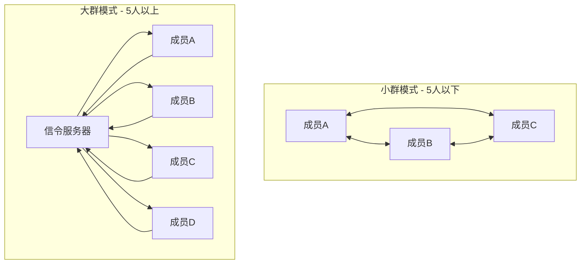
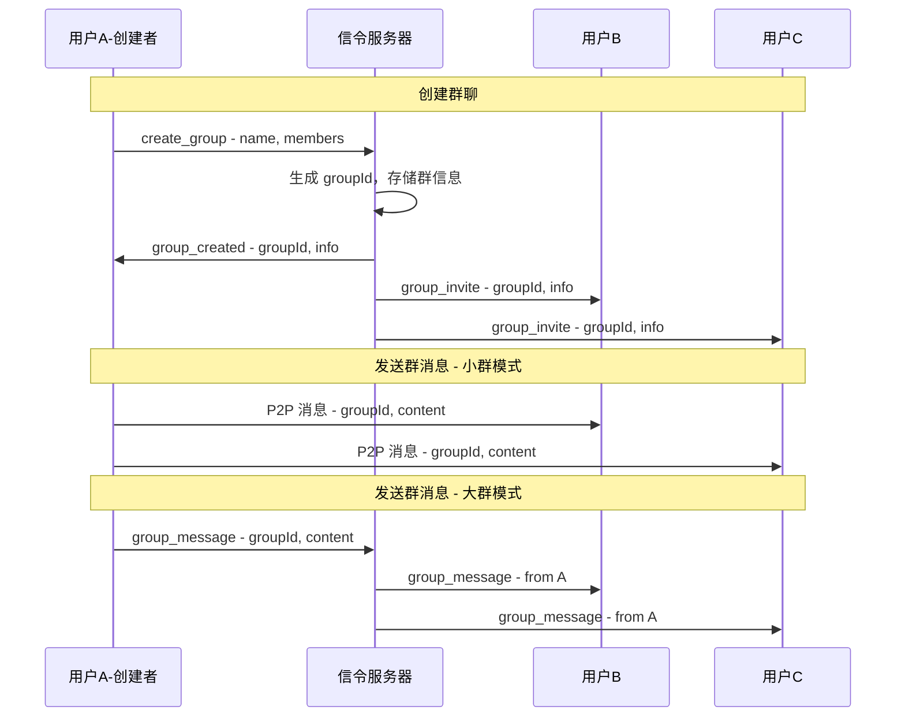

# P2P Chat UI 重构 + 群聊功能设计方案

## 一、UI 布局重构

### 新布局结构（从左到右）

```
┌──────┬─────────────┬──────────────────────┬─────────────────┐
│      │             │                      │                 │
│ 菜单 │   联系人    │      聊天框          │   文件传输      │
│ 栏   │   列表      │                      │   面板(可隐藏)  │
│      │             │                      │                 │
│ 60px │   280px     │      flex: 1         │    320px        │
│      │             │                      │                 │
└──────┴─────────────┴──────────────────────┴─────────────────┘
```

### 1.1 菜单栏（左侧垂直导航）

参考图片中的左侧图标栏，包含三个主要功能：

```
┌────────┐
│  Logo  │  ← P2P Chat Logo
├────────┤
│   💬   │  ← 单对单聊天（默认选中）
├────────┤
│   👥   │  ← 群聊功能
├────────┤
│   ⚙️   │  ← 设置
├────────┤
│        │
│  空白  │
│        │
├────────┤
│  头像  │  ← 当前用户头像
└────────┘
```

**菜单项设计：**
- 宽度：60px
- 图标大小：24px
- 选中状态：左侧边框高亮 + 背景色变化
- 悬停效果：背景色变浅

### 1.2 联系人列表（第二栏）

根据当前菜单选择显示不同内容：

**单对单聊天模式：**
- 搜索框
- 分类标签（可折叠）
- 联系人列表（带在线状态、未读数）

**群聊模式：**
- 搜索框
- 创建群聊按钮
- 群组列表（显示群名、成员数、最后消息）

**设置模式：**
- 设置选项列表

### 1.3 聊天框（第三栏）

保持现有设计，增强功能：
- 聊天头部：对方信息 + 操作按钮
- 消息区域：支持单聊和群聊消息
- 输入区域：无痕模式开关 + 文件按钮 + 输入框 + 发送

### 1.4 文件传输面板（第四栏，可隐藏）

- 默认隐藏
- 点击文件传输按钮后滑出
- 显示当前传输列表
- 支持拖拽上传

---

## 二、群聊功能方案

### 方案对比

| 方案 | 描述 | 优点 | 缺点 | 推荐度 |
|------|------|------|------|--------|
| **方案 A: 信令服务器中继** | 群消息通过信令服务器转发给所有群成员 | 实现简单，稳定可靠 | 非真正 P2P，服务器负载大 | ⭐⭐⭐ |
| **方案 B: 全网状 P2P** | 每个群成员与其他所有成员建立 P2P 连接 | 真正去中心化 | 连接数爆炸（n*(n-1)/2），资源消耗大 | ⭐⭐ |
| **方案 C: 星型 P2P** | 群主作为中心节点，其他成员只与群主连接 | 连接数少（n-1） | 群主离线则群聊不可用 | ⭐⭐⭐ |
| **方案 D: 混合模式** | 小群用全网状，大群用信令中继 | 灵活，兼顾性能 | 实现复杂 | ⭐⭐⭐⭐ |

### 推荐方案：方案 D - 混合模式



### 群聊数据结构

```javascript
// 群组信息
{
    groupId: "group_xxx",
    name: "群组名称",
    avatar: "群头像URL或颜色",
    creator: "创建者用户名",
    members: ["user1", "user2", "user3"],
    createdAt: "ISO8601",
    settings: {
        maxMembers: 50,
        allowInvite: true,  // 是否允许成员邀请
    }
}

// 群消息
{
    id: "msg_xxx",
    groupId: "group_xxx",
    from: "发送者用户名",
    content: "消息内容",
    timestamp: "ISO8601",
    isIncognito: false,
}
```

### 群聊功能流程



---

## 三、设置面板功能

### 设置选项列表

```
┌─────────────────────────────────┐
│         设置                    │
├─────────────────────────────────┤
│ 👤 个人资料                     │
│    修改昵称、头像               │
├─────────────────────────────────┤
│ 🎨 主题设置                     │
│    • 自动（跟随时间）           │
│    • 浅色模式                   │
│    • 深色模式                   │
├─────────────────────────────────┤
│ 🔔 通知设置                     │
│    • 消息通知开关               │
│    • 通知声音开关               │
├─────────────────────────────────┤
│ 🔒 隐私设置                     │
│    • 无痕模式默认开启           │
│    • 阅后即焚时间（5/10/30秒）  │
├─────────────────────────────────┤
│ 💾 数据管理                     │
│    • 清除所有聊天记录           │
│    • 导出聊天记录               │
├─────────────────────────────────┤
│ 🌐 网络设置                     │
│    • 信令服务器地址             │
│    • STUN/TURN 服务器           │
├─────────────────────────────────┤
│ ℹ️ 关于                         │
│    版本信息、开源协议           │
└─────────────────────────────────┘
```

### 设置数据存储

```javascript
// localStorage 存储
{
    "p2pchat_settings": {
        "theme": "auto",           // auto | light | dark
        "notifications": true,
        "notificationSound": true,
        "defaultIncognito": false,
        "incognitoTimeout": 10,    // 秒
        "signalServer": "ws://...",
    }
}
```

---

## 四、实施计划

### 阶段 1：UI 布局重构
1. 修改 HTML 结构，添加四栏布局
2. 更新 CSS 样式，实现响应式设计
3. 实现菜单栏切换逻辑

### 阶段 2：设置面板
1. 实现设置选项 UI
2. 实现设置数据持久化
3. 应用设置到各功能

### 阶段 3：群聊功能
1. 后端：扩展信令服务器支持群组
2. 前端：群组列表 UI
3. 前端：创建群聊流程
4. 前端：群消息收发
5. P2P：小群全网状连接

### 阶段 4：文件传输面板优化
1. 改为可隐藏的右侧面板
2. 添加滑出动画
3. 优化传输列表 UI

---

## 五、技术要点

### 信令服务器扩展

需要新增的消息类型：
- `create_group` - 创建群组
- `group_created` - 群组创建成功
- `group_invite` - 群组邀请
- `join_group` - 加入群组
- `leave_group` - 离开群组
- `group_message` - 群消息（大群模式）
- `group_members` - 群成员列表更新

### 前端状态管理

```javascript
App.groups = {};           // 群组信息
App.currentGroup = null;   // 当前选中的群组
App.groupHistory = {};     // 群聊历史记录
App.menuMode = 'chat';     // chat | group | settings
```
